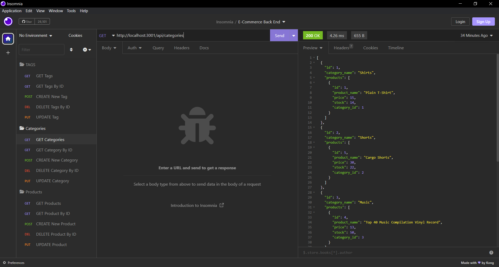
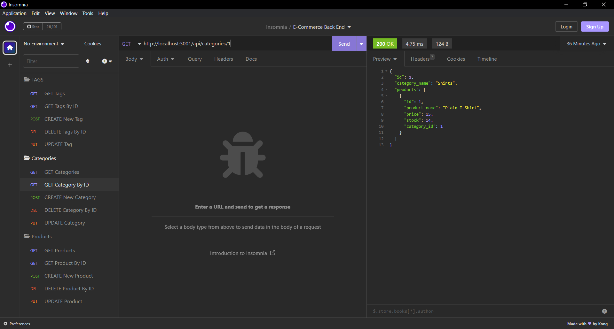
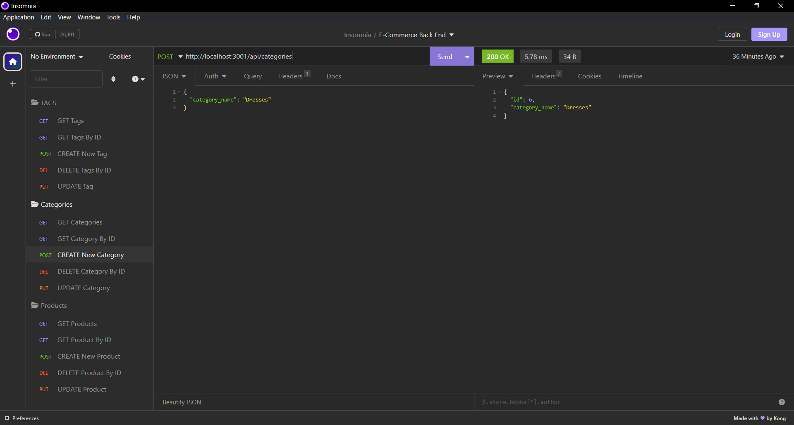
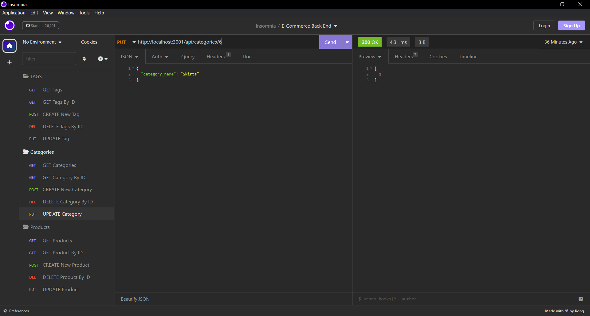
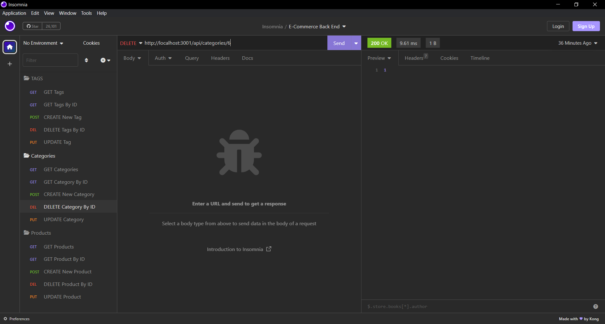

# E-Commerce Back End

## Table of Contents
- [Description](#description)
- [Instructions](#instructions)
- [Visuals](#visuals)

## Description 
This application is used as the backend portion for an e-commerce site.

Features Include:
- The ability to get information for all tags, categories, and products.
- The ability to get information by ID for tags, categories, and products. 
- The ability to create new data for tags, categories, and products. 
- The ability to update data for tags, categories, and products.
- The ability to delete tags, categories, and products. 

## Instructions
- To create the schema from the MySQL shell: 
    - Enter <strong>"mysql -u root"</strong> in the command line
    - Once MySQL starts, enter <strong>"source db/schema.sql"</strong>
    - Once the schema is run, enter <strong>"exit"</strong>
- To seed the database: Enter <strong>"npm run seed"</strong> in the command line
- To start the application: Enter <strong>"npm start"</strong> in the command line

## Visuals 

The following is a link to a video demo:

[Walkthrough Video](https://drive.google.com/file/d/1E60LeNCPBPY0gqwAzMmRf1cWWUGaBO7z/view)

The following is a screenshot of an example "Get All":

The following is a screenshot of an example "Get By ID":

The following is a screenshot of an example "Create":

The following is a screenshot of an example "Update":

The following is a screenshot of an example "Delete":

